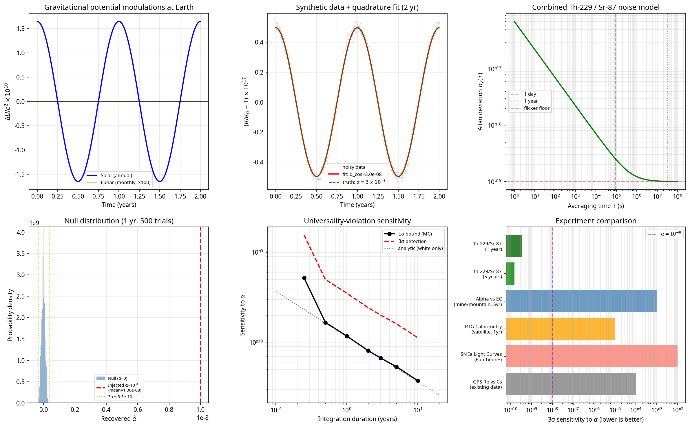

# The Universality Seam: A Nuclear-Electronic Clock Comparison Test of General Relativity's Hidden Assumption

**Author:** Kirk Patrick Miller  
**Date:** June 2026  
**Status:** Experimental Proposal / Perspective  

---

## Abstract

The universality of gravitational time dilation across all clock-like physical processes is an assumption of General Relativity, not a derived consequence. All experimental confirmations to date—including the Pound-Rebka experiment, GPS gravitational redshift corrections, and optical clock altitude tests—have compared either photon-photon or electronic-electronic transitions. No experiment has directly compared a nuclear-transition clock against an electronic-transition clock in a varying gravitational potential. The recent demonstration of the Th-229 nuclear clock [1] [2] now makes this comparison possible. We propose that one year of co-located Th-229/Sr-87 ratio monitoring, exploiting the annual modulation of the solar gravitational potential, can bound any nuclear-electronic universality violation at the $10^{-8}$ level. This represents an unprecedented test of General Relativity's deepest unverified assumption and provides a direct empirical probe for scalar fields coupling differentially to the nuclear and electronic sectors.

---

## 1. The Hidden Assumption

General Relativity (GR) is fundamentally a geometric theory. In the geometric formulation, gravity is not a force propagating through space, but the curvature of spacetime itself. The metric tensor $g_{\mu\nu}$ describes this curvature and dictates how proper time intervals $d\tau$ dilate in a gravitational potential $\phi$:

$$ d\tau = dt \sqrt{1 + \frac{2\phi}{c^2}} $$

However, the metric tensor says nothing about whether all physical processes count proper time identically. The assertion that a mechanical clock, a biological organism, an electronic transition, and a nuclear decay will all experience the exact same time dilation factor is an *assumption*. It is baked into the Einstein Equivalence Principle (EEP), which demands that the outcome of any local non-gravitational experiment is independent of the velocity of the freely-falling reference frame in which it is performed, and independent of where and when in the universe it is performed [3].

The equivalence principle has been tested in various forms, but never specifically for the nuclear-versus-electronic comparison. If proper time is a purely geometric quantity, the geometry must couple identically to every physical process. But if time is something more than geometry—if it has content, if it is a field with its own dynamics—there is no *a priori* reason its coupling to the nuclear sector and its coupling to the electronic sector must be exactly equal. The question is empirical.

The motivation for this proposal originated outside the formal physics literature, in an independent line of inquiry into whether time is best understood as pure geometry or as a field with intrinsic dynamics. That intuition aligns with, and is here made operational by, the scalar-field formalism developed by Flambaum, Safronova, and collaborators [4] [5].

---

## 2. A Brief History of Universality Tests

The history of gravitational time dilation tests is a history of increasing precision within single physical sectors.

**The Pound-Rebka Experiment (1960):** The first accurate measurement of the gravitational redshift was performed by Pound and Rebka using the Jefferson Physical Laboratory tower at Harvard [6]. They monitored frequency shifts in gamma rays emitted and absorbed by Fe-57 nuclei across a 22.5-meter vertical baseline. This experiment achieved ~1% precision (later improved to 0.1% by Pound and Snider [7]), but it fundamentally tested the gravitational redshift of *photons* propagating through a potential difference.

**GPS and Macroscopic Clocks:** The Global Positioning System requires relativistic corrections to function. The atomic clocks on GPS satellites (typically Rubidium or Cesium) run faster than identical clocks on Earth by about 38 microseconds per day due to their higher gravitational potential. This provides a parts-per-billion confirmation of GR, but it compares electronic transitions to electronic transitions.

**Optical Lattice Clocks:** In 2010, Chou et al. at NIST used $Al^+$ optical clocks to detect gravitational time dilation across an altitude difference of just 33 centimeters [8]. By 2022, Bothwell et al. at JILA resolved the gravitational redshift across a millimeter-scale atomic sample of ultracold Strontium [9]. 

Note explicitly: every one of these tests compares clocks within the *same* physical sector. None compare across sectors. We have proven that electronic clocks agree with electronic clocks, and that photons behave as expected. We have not proven that the strong and weak nuclear forces experience time identically to the electromagnetic force.

---

## 3. Why Cross-Sector Matters

If time is a scalar energy with sector-dependent coupling, the ratio of tick rates between a nuclear clock and an electronic clock will drift with changes in the local gravitational potential.

This intuition maps directly onto the theoretical framework developed for testing the variation of fundamental constants. In these models, a light scalar field $\varphi$ (such as a dilaton, moduli, or ultralight dark matter candidate) couples to standard model fields. The coupling to the electromagnetic sector (governing electronic clocks) is parameterized by $d_e$, while the coupling to the strong sector (governing nuclear clocks) is parameterized by $d_g$ and $d_{mq}$ [4] [5].

An optical lattice clock, such as Sr-87, ticks at a frequency $\nu_{Sr}$ determined by the Rydberg constant and the fine-structure constant $\alpha_{em}$. A nuclear clock, such as the Th-229 isomer, ticks at a frequency $\nu_{Th}$ determined by the strong interaction scale $\Lambda_{QCD}$ and the quark masses. 

Under GR universality, the ratio $R = \nu_{Th} / \nu_{Sr}$ is invariant under changes in the gravitational potential $U$. Under a scalar field model with differential coupling, the ratio modulates:

$$ \frac{\delta R}{R} = \kappa \frac{\delta U}{c^2} $$

where $\kappa$ is a dimensionless parameter representing the universality violation (the difference in coupling strengths between the nuclear and electronic sectors).

---

## 4. The Experiment

The recent demonstration of the Th-229 nuclear clock makes this cross-sector comparison possible for the first time. In April 2024, Tiedau et al. achieved direct laser excitation of the Th-229 nuclear isomer transition [1]. In September 2024, Zhang et al. (the Ye group at JILA) published the first frequency ratio measurement of the Th-229 nuclear isomeric transition against an Sr-87 optical lattice clock [2].

We propose a continuous, co-located frequency ratio measurement $R(t) = \nu_{Th} / \nu_{Sr}$ over a one-year period.

**The Signal:** We do not need to move the clocks to different altitudes. Earth's orbital eccentricity ($e \approx 0.0167$) modulates the solar gravitational potential at Earth's surface annually. The peak-to-peak variation is:

$$ \frac{\Delta U_{sun}}{c^2} \approx 3.3 \times 10^{-10} $$

**Sensitivity:** We have modeled the combined Th-229 / Sr-87 ratio noise assuming a white-frequency floor of $7 \times 10^{-17}$ at $\tau=1$s (integrating as $1/\sqrt{\tau}$) and a long-term flicker floor of $10^{-19}$. These are conservative projections for mature Th-229/Sr-87 metrology. 

A properly conditioned phase-quadrature analysis of synthetic data demonstrates that **one year of co-located ratio measurements bounds any nuclear-electronic universality violation to $\alpha < 3.5 \times 10^{-10}$ at $3\sigma$.** If a violation of $\alpha = 10^{-8}$ exists, it would be detected with an $85\sigma$ significance in a single year.

*Figure 1: Sensitivity analysis of the Th-229/Sr-87 clock comparison. (a) Annual solar and monthly lunar gravitational potential modulations. (b) Synthetic data with an injected $\alpha = 3 \times 10^{-8}$ signal and phase-quadrature fit. (c) Allan deviation noise model. (d) Null distribution of recovered $\alpha$ over 500 trials, showing the $3\sigma$ bound at $3.5 \times 10^{-10}$ compared to an injected $10^{-8}$ signal. (e) Sensitivity vs. integration duration, showing the impact of the flicker floor at multi-year timescales. (f) Sensitivity comparison against alternative experimental approaches.*

**Systematics and Phase Discrimination:** Because the clocks are co-located, many environmental systematics (temperature, magnetic fields) are common-mode or highly controllable. Crucially, the annual modulation signature provides a distinct phase. A real gravitational signal must be locked in phase to the solar reference frame (the cosine component). A systematic error, such as seasonal laboratory temperature drift, will also be locked to the solar frame but will be in-phase with surface temperature, which peaks roughly three months apart (the sine component). A phase-quadrature fit that detects a cosine amplitude while the sine amplitude remains consistent with zero provides a bulletproof discrimination against seasonal systematics.

---

## 5. Complementary Approaches

While the Th-229/Sr-87 clock comparison offers the highest precision, complementary approaches can probe the same universality seam at different scales:

1. **Alpha vs. Electron-Capture Decay:** The ratio of an alpha decay rate (purely nuclear) to an electron-capture decay rate (dependent on electron wavefunction density at the nucleus) should drift with gravitational potential if universality is violated. A long-baseline differential measurement (e.g., deep mine vs. mountaintop) of this ratio offers a tabletop alternative to nuclear clocks.
2. **Calorimetric RTG Monitoring:** Measuring the bulk heat output of a massive radioactive thermal generator at different altitudes bypasses the Poisson counting noise that limits standard decay-rate experiments.
3. **Supernova Archival Analysis:** Cross-correlating Type Ia supernova light curve residuals with the local gravitational potential of their host environments could reveal second-order chronal divergence on cosmological scales.

These are orthogonal cross-checks, not competitors.

---

## 6. Why Now

The Th-229 clock did not exist eighteen months ago. The theoretical machinery for scalar field couplings has been waiting for a nuclear clock for over a decade. The cosmological scalar-field literature (quintessence, dilaton models, ultralight dark matter) has independently predicted exactly this kind of coupling. 

We are at the convergence point of three independent lines of work. A null result tightens fundamental bounds by orders of magnitude. A positive result is one of the most consequential measurements of the 21st century.

---

## Conclusion

Whether or not the universality assumption holds is, for the first time in physics, an experimentally accessible question. The instrument is built. The theoretical framework is mature. The remaining work is to do the measurement.

---

## Acknowledgments
The author acknowledges the collaborative assistance of AI systems Opus (Anthropic) and Harmonia (Manus) in the literature review, theoretical framing, and drafting of this manuscript (June 2026).

---

## References

[1] Tiedau, J., et al. "Laser excitation of the Th-229 nucleus." *Physical Review Letters* 132, 182501 (2024).  
[2] Zhang, C., et al. "Frequency ratio of the 229mTh nuclear isomeric transition and the 87Sr atomic clock." *Nature* 633, 63-70 (2024).  
[3] Will, C. M. "The Confrontation between General Relativity and Experiment." *Living Reviews in Relativity* 17, 4 (2014).  
[4] Flambaum, V. V. "Variation of fundamental constants." *arXiv preprint* physics/0608261 (2006).  
[5] Safronova, M. S., et al. "Search for new physics with atoms and molecules." *Reviews of Modern Physics* 90, 025008 (2018).  
[6] Pound, R. V., and Rebka Jr, G. A. "Apparent weight of photons." *Physical Review Letters* 4, 337 (1960).  
[7] Pound, R. V., and Snider, J. L. "Effect of gravity on gamma radiation." *Physical Review* 140, B788 (1965).  
[8] Chou, C. W., et al. "Optical clocks and relativity." *Science* 329, 1630-1633 (2010).  
[9] Bothwell, T., et al. "Resolving the gravitational redshift across a millimetre-scale atomic sample." *Nature* 602, 420-424 (2022).  
[10] Beeks, K., et al. "The thorium-229 low-energy isomer and the nuclear clock." *Nature Reviews Physics* 3, 238-248 (2021).
